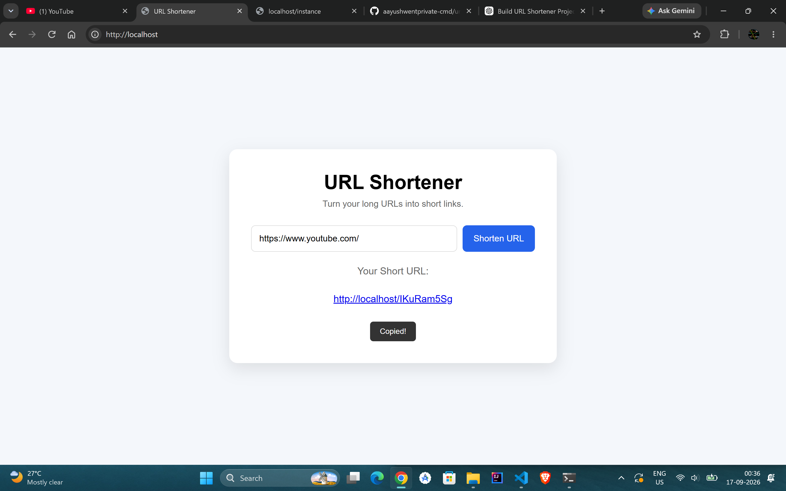

# Scalable URL Shortener

A URL shortener built with Node.js and Express.js, enhanced with practical system design concepts such as Redis caching, MongoDB indexing, rate limiting, NGINX load balancing, horizontal scaling, PM2 process management, and health checks.

## Application



## Links

- **GitHub:** https://github.com/aayushwentprivate-cmd/url-shortener
- **Live Demo:** Coming soon

## Features

- Create short URLs from long URLs
- Redirect short URLs to original URLs
- Track click counts
- Prevent duplicate URLs
- Redis caching for faster redirects
- MongoDB indexes for efficient lookups
- API rate limiting
- Multiple Node.js instances
- NGINX load balancing
- PM2 process management
- Health check endpoint

### Example Response

```json
{
  "originalUrl": "https://www.youtube.com",
  "shortCode": "abc123",
  "clicks": 0
}

## Tech Stack

- **Backend:** Node.js, Express.js
- **Database:** MongoDB Atlas
- **Cache:** Redis Cloud
- **Load Balancer:** NGINX
- **Process Manager:** PM2
- **Frontend:** HTML, CSS, JavaScript

## Architecture

```text
                    Client
                       |
                       v
                  NGINX :80
                       |
               Load Balancer
                 /         \
                v           v
           Node.js :5000  Node.js :5001
                \           /
                 \         /
                  v       v
                Redis   MongoDB
                Cache   Database